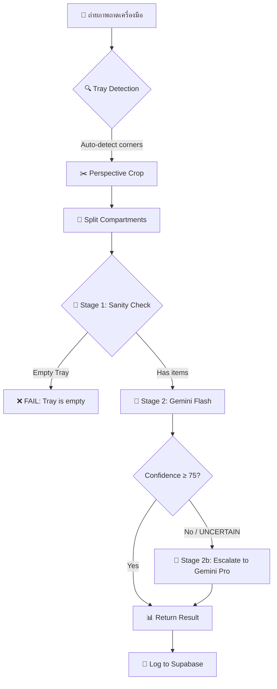

# 🏥 Medical Equipment Verification System for Hospital

ระบบ AI สำหรับตรวจสอบความถูกต้องและความครบถ้วนของเครื่องมือแพทย์ (Surgical Instrument Verification) ก่อนขั้นตอนการแพ็คและนึ่งฆ่าเชื้อ — ออกแบบมาเพื่อใช้งานจริงในแผนก **CSSD (Central Sterile Supply Department)** ของโรงพยาบาล

> **Live Demo:** [https://huggingface.co/spaces/zonewtonx/phusinghos-equip-verify](https://huggingface.co/spaces/zonewtonx/phusinghos-equip-verify)

---

## 📋 Table of Contents

- [Overview](#overview)
- [Features](#features)
- [System Architecture](#system-architecture)
- [Tech Stack](#tech-stack)
- [Project Structure](#project-structure)
- [Getting Started](#getting-started)
  - [Prerequisites](#prerequisites)
  - [Environment Variables](#environment-variables)
  - [Quick Start (Windows)](#quick-start-windows)
  - [Manual Setup](#manual-setup)
  - [Docker](#docker)
- [Deployment](#deployment)
  - [Hugging Face Spaces](#hugging-face-spaces)
  - [CI/CD](#cicd)
- [Database Setup (Supabase)](#database-setup-supabase)
- [API Reference](#api-reference)
- [How It Works](#how-it-works)
- [License](#license)

---

## Overview

เจ้าหน้าที่ CSSD ต้องตรวจนับเครื่องมือแพทย์ในถาดทุกครั้งก่อนห่อเพื่อนึ่งฆ่าเชื้อ ระบบนี้ช่วยเร่งกระบวนการดังกล่าวโดยใช้ **Computer Vision + Vision Language Model (VLM)** วิเคราะห์ภาพถ่ายถาดเครื่องมือแล้วเปรียบเทียบกับ Checklist ที่กำหนดไว้ จากนั้นแจ้งผลทันทีว่า **PASS / FAIL / UNCERTAIN** พร้อมระบุรายการที่ขาดหรือเกิน

---

## Features

| Feature | Description |
|---|---|
| 📸 **Multi-input Capture** | รองรับกล้องมือถือ, Webcam (WebRTC), และอัปโหลดภาพจากไฟล์ |
| 🔍 **Tray Auto-Detection** | ตรวจจับขอบถาดสแตนเลสอัตโนมัติด้วย OpenCV (Canny Edge + Contour) |
| ✂️ **Compartment Splitting** | แบ่งถาดออกเป็น 3 ช่อง (2 เล็ก + 1 ใหญ่) ด้วย Hough Line Detection |
| 🧠 **AI Verification (Tiered)** | ใช้ Gemini Flash ก่อน → Escalate ไป Gemini Pro เมื่อ confidence ต่ำ |
| 📊 **Dashboard** | สรุปสถิติ PASS/FAIL/UNCERTAIN, แสดง Daily breakdown, และ Recent logs |
| ⚙️ **Set Management (Admin)** | CRUD จัดการชุดเครื่องมือ (Instrument Sets) + Checklist Items |
| 📱 **PWA (Mobile-first)** | ติดตั้งเป็นแอปบนมือถือได้, Offline-capable ด้วย Service Worker |
| 🔒 **Password Protection** | ป้องกัน API ด้วยรหัสผ่าน (Optional) |
| ☁️ **Cloud-ready** | Deploy ได้ทั้ง Hugging Face Spaces (Docker) และ Local Network (HTTPS) |

---

## System Architecture

```
┌─────────────────────────────────────────────────────────────────┐
│                        Frontend (PWA)                           │
│  index.html  │  admin.html  │  dashboard.html                  │
│  app.js      │  admin.js    │  style.css                       │
└──────────────────────────┬──────────────────────────────────────┘
                           │ HTTPS / REST API
┌──────────────────────────▼──────────────────────────────────────┐
│                     FastAPI Backend                              │
│  ┌──────────────┐  ┌──────────────────┐  ┌──────────────────┐  │
│  │ Tray Detector │  │  VLM Verifier    │  │    Database       │  │
│  │  (OpenCV)     │  │  (Gemini API)    │  │   (Supabase)     │  │
│  └──────────────┘  └──────────────────┘  └──────────────────┘  │
└─────────────────────────────────────────────────────────────────┘
```

---

## Tech Stack

| Layer | Technology |
|---|---|
| **Backend** | Python 3.12, FastAPI, Uvicorn |
| **AI/Vision** | Google Gemini API (Flash + Pro), OpenCV, NumPy, Pillow |
| **Database** | Supabase (PostgreSQL + REST API) |
| **Frontend** | Vanilla HTML/CSS/JS, PWA (Service Worker + Manifest) |
| **Deployment** | Docker, Hugging Face Spaces, GitHub Actions CI/CD |
| **Security** | Self-signed SSL (HTTPS), Password-protected API |

---

## Project Structure

```
medical-equipment-verification-system-for-hospital/
├── .github/
│   └── workflows/
│       └── sync_hf.yml              # CI/CD: Auto-deploy to Hugging Face
├── web_app/
│   ├── backend/
│   │   ├── __init__.py
│   │   ├── main.py                  # FastAPI app + API endpoints
│   │   ├── config.py                # Environment variable configuration
│   │   ├── models.py                # Pydantic schemas (request/response)
│   │   ├── database.py              # Supabase client (CRUD + logs)
│   │   └── services/
│   │       ├── __init__.py
│   │       ├── tray_detector.py     # OpenCV tray detection & splitting
│   │       └── vlm_verifier.py      # Gemini VLM tiered verification
│   ├── frontend/
│   │   ├── index.html               # Main verification page
│   │   ├── admin.html               # Instrument set management
│   │   ├── dashboard.html           # Statistics dashboard
│   │   ├── manifest.json            # PWA manifest
│   │   ├── sw.js                    # Service Worker
│   │   ├── css/
│   │   │   └── style.css            # Global styles (dark theme)
│   │   └── js/
│   │       ├── app.js               # Main app logic (capture, verify)
│   │       └── admin.js             # Admin CRUD logic
│   ├── Dockerfile                   # Docker image for HF Spaces
│   ├── requirements.txt             # Python dependencies
│   ├── generate_cert.py             # Self-signed SSL certificate generator
│   ├── start_server.bat             # One-click server startup (Windows)
│   ├── supabase_migration.sql       # Database schema + seed data
│   └── .gitignore
└── README.md
```

---

## Getting Started

### Prerequisites

- **Python** 3.10 หรือใหม่กว่า
- **Gemini API Key** — รับได้ที่ [Google AI Studio](https://aistudio.google.com/apikey)
- **Supabase Project** — สร้างฟรีที่ [supabase.com](https://supabase.com) (ใช้เก็บ Instrument Sets และ Verification Logs)

### Environment Variables

สร้างไฟล์ `.env` ใน `web_app/`:

```env
# Required
GEMINI_API_KEY=your_gemini_api_key_here
SUPABASE_URL=https://your-project.supabase.co
SUPABASE_KEY=your_supabase_anon_key

# Optional
APP_PASSWORD=                      # ตั้งรหัสผ่านเข้าใช้งาน (เว้นว่าง = ไม่ต้องล็อกอิน)
GEMINI_MODEL_FAST=gemini-2.5-flash # โมเดลเริ่มต้น (เร็ว)
GEMINI_MODEL_PRO=gemini-2.5-pro    # โมเดลสำรอง (แม่นยำ)
GEMINI_ESCALATION_THRESHOLD=75     # ค่า confidence ขั้นต่ำ ก่อน escalate ไป Pro
MAX_IMAGE_SIZE=1920                # ขนาดภาพสูงสุด (px)
ALLOWED_ORIGINS=*                  # CORS origins (คั่นด้วย ,)
```

### Quick Start (Windows)

วิธีที่ง่ายที่สุด — ดับเบิลคลิก `start_server.bat`:

```
cd web_app
start_server.bat
```

Script จะทำงานต่อไปนี้ให้อัตโนมัติ:

1. ✅ ตรวจสอบว่ามี Python หรือไม่
2. ✅ สร้าง Virtual Environment (`.venv`)
3. ✅ ติดตั้ง Dependencies ทั้งหมด
4. ✅ สร้าง SSL Certificate (Self-signed)
5. ✅ เปิดเซิร์ฟเวอร์ HTTPS บนพอร์ต `8000`

เปิดเบราว์เซอร์ไปที่ `https://<YOUR-IP>:8000` (ต้องกด **Advanced → Proceed** เพราะเป็น Self-signed Certificate)

### Manual Setup

```bash
# 1. Clone repository
git clone https://github.com/newton1306/medical-equipment-verification-system-for-hospital.git
cd medical-equipment-verification-system-for-hospital/web_app

# 2. สร้าง Virtual Environment
python -m venv .venv

# 3. Activate
# Windows:
.venv\Scripts\activate
# Linux/macOS:
source .venv/bin/activate

# 4. ติดตั้ง Dependencies
pip install -r requirements.txt

# 5. สร้างไฟล์ .env (ดูหัวข้อ Environment Variables)

# 6. รันเซิร์ฟเวอร์
uvicorn backend.main:app --host 0.0.0.0 --port 8000
```

> 💡 **หมายเหตุ:** หากต้องการใช้กล้องบนมือถือผ่าน WiFi จำเป็นต้องใช้ HTTPS — รัน `python generate_cert.py` แล้วเพิ่ม `--ssl-keyfile key.pem --ssl-certfile cert.pem`

### Docker

```bash
cd web_app
docker build -t equip-verify .
docker run -p 7860:7860 --env-file .env equip-verify
```

เปิดเบราว์เซอร์ที่ `http://localhost:7860`

---

## Deployment

### Hugging Face Spaces

โปรเจกต์นี้ Deploy เป็น Docker Space บน Hugging Face โดยอัตโนมัติ:

1. Push ไปที่ branch `main` (เฉพาะไฟล์ใน `web_app/`)
2. GitHub Actions จะ sync โฟลเดอร์ `web_app/` ไปยัง Hugging Face Space โดยอัตโนมัติ
3. Space URL: `https://huggingface.co/spaces/zonewtonx/phusinghos-equip-verify`

### CI/CD

ไฟล์ `.github/workflows/sync_hf.yml` ทำงานเมื่อ:

- Push ไปที่ `main` branch ที่แก้ไขไฟล์ใน `web_app/`
- หรือ Trigger ด้วยมือผ่าน `workflow_dispatch`

**ต้องตั้งค่า Secret:**

- `HF_TOKEN` — Hugging Face Access Token

---

## Database Setup (Supabase)

1. สร้างโปรเจกต์ใหม่ที่ [supabase.com](https://supabase.com)
2. เปิด **SQL Editor** แล้วรันไฟล์ `web_app/supabase_migration.sql`
3. Script จะสร้าง:

| Table | Description |
|---|---|
| `instrument_sets` | ชุดเครื่องมือแพทย์ (เช่น Dressing Set, Minor Set) |
| `checklist_items` | รายการเครื่องมือในแต่ละชุด + จำนวนที่ต้องมี |
| `verification_logs` | บันทึกผลการตรวจสอบทุกครั้ง |

1. RLS (Row Level Security) เปิดไว้แบบ **allow all** — เหมาะสำหรับ Internal network

---

## API Reference

Base URL: `https://<host>:<port>`

### Verification

| Method | Endpoint | Description |
|---|---|---|
| `POST` | `/api/verify` | ตรวจสอบถาดเครื่องมือ (main endpoint) |
| `POST` | `/api/detect-tray` | ตรวจจับถาด + แสดง Preview ช่องแบ่ง |
| `POST` | `/api/detect_boundary` | ตรวจจับขอบถาดอย่างเดียว |

### Instrument Sets (CRUD)

| Method | Endpoint | Description |
|---|---|---|
| `GET` | `/api/sets` | ดึงรายการชุดเครื่องมือทั้งหมด |
| `GET` | `/api/sets/{set_id}` | ดึงชุดเครื่องมือตาม ID |
| `POST` | `/api/sets` | สร้างชุดเครื่องมือใหม่ |
| `PUT` | `/api/sets/{set_id}` | แก้ไขชุดเครื่องมือ |
| `DELETE` | `/api/sets/{set_id}` | ลบชุดเครื่องมือ |

### Auth & Dashboard

| Method | Endpoint | Description |
|---|---|---|
| `POST` | `/api/login` | ล็อกอิน (ถ้าตั้ง `APP_PASSWORD`) |
| `GET` | `/api/dashboard` | ดึงสถิติ PASS/FAIL/UNCERTAIN + Daily breakdown |
| `GET` | `/api/logs?limit=50` | ดึง Verification Logs ล่าสุด |

### Frontend Pages

| Path | Page |
|---|---|
| `/` | หน้าหลัก — ถ่ายภาพ + ตรวจสอบ |
| `/admin` | จัดการชุดเครื่องมือ (CRUD) |
| `/dashboard` | สถิติและ Logs |

---

## How It Works



### Verification Pipeline

1. **Capture** — ผู้ใช้ถ่ายภาพถาดเครื่องมือผ่านกล้องมือถือ / Webcam / อัปโหลดไฟล์
2. **Tray Detection** — OpenCV ตรวจจับขอบถาดสแตนเลส (Canny Edge Detection + Contour Approximation)
3. **Perspective Correction** — Warp ภาพเป็นมุมมองด้านบน (bird's-eye view)
4. **Compartment Splitting** — แบ่งถาดออกเป็น 3 ช่อง ด้วย Hough Line Detection
5. **Stage 1 (Local)** — ตรวจสอบเบื้องต้นว่าถาดว่างหรือไม่ (Edge ratio analysis)
6. **Stage 2 (VLM)** — ส่งภาพ Close-up แต่ละช่อง + ภาพรวม + Reference image ไปยัง Gemini API
7. **Tiered Escalation** — ถ้า Flash ให้ confidence ต่ำ (< 75) จะ Escalate ไปใช้ Pro อัตโนมัติ
8. **Result** — แสดงผล PASS ✅ / FAIL ❌ / UNCERTAIN ⚠️ พร้อมรายละเอียด

---

## License

This project is developed for academic and hospital internal use.
