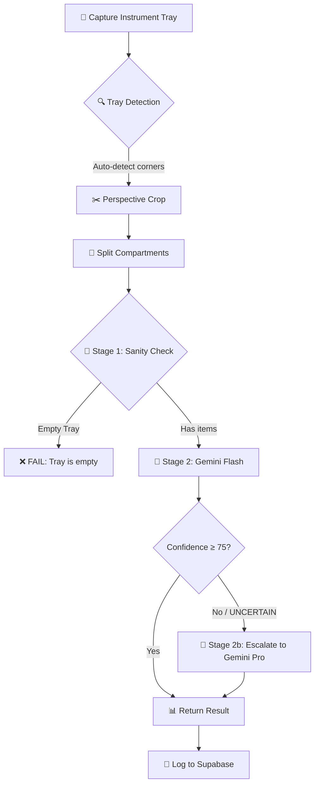

# 🏥 Medical Equipment Verification System for Hospital

An AI-powered system for verifying the correctness and completeness of surgical instrument trays before packing and sterilization — designed for real-world use in the **CSSD (Central Sterile Supply Department)** of hospitals.

---

## 📋 Table of Contents

- [Overview](#overview)
- [Features](#features)
- [System Architecture](#system-architecture)
- [Tech Stack](#tech-stack)
- [Project Structure](#project-structure)
- [Getting Started](#getting-started)
  - [Prerequisites](#prerequisites)
  - [Environment Variables](#environment-variables)
  - [Manual Setup](#manual-setup)
  - [Docker](#docker)
- [Deployment](#deployment)
  - [Hugging Face Spaces](#hugging-face-spaces)
  - [CI/CD](#cicd)
- [Database Setup (Supabase)](#database-setup-supabase)
- [API Reference](#api-reference)
- [How It Works](#how-it-works)
- [License](#license)

---

## Overview

CSSD staff must manually count and verify every surgical instrument in a tray before wrapping it for sterilization. This system accelerates that process by using **Computer Vision + Vision Language Model (VLM)** to analyze photos of instrument trays and compare them against a predefined checklist, instantly reporting **PASS / FAIL / UNCERTAIN** along with details on any missing or extra items.

---

## Features

| Feature | Description |
|---|---|
| 📸 **Multi-input Capture** | Supports mobile camera, Webcam (WebRTC), and file upload |
| 🔍 **Tray Auto-Detection** | Automatically detects stainless steel tray boundaries using OpenCV (Canny Edge + Contour) |
| ✂️ **Compartment Splitting** | Splits the tray into 3 compartments (2 small + 1 large) via Hough Line Detection |
| 🧠 **AI Verification (Tiered)** | Uses Gemini Flash first → Escalates to Gemini Pro when confidence is low |
| 📊 **Dashboard** | Summarizes PASS/FAIL/UNCERTAIN statistics with daily breakdown and recent logs |
| ⚙️ **Set Management (Admin)** | Full CRUD for managing Instrument Sets and Checklist Items |
| 📱 **PWA (Mobile-first)** | Installable as a mobile app, offline-capable via Service Worker |
| 🔒 **Password Protection** | Optional password-protected API access |
| ☁️ **Cloud-ready** | Deployable on Hugging Face Spaces (Docker) and local network (HTTPS) |

---

## System Architecture

```
┌─────────────────────────────────────────────────────────────────┐
│                        Frontend (PWA)                           │
│  index.html  │  admin.html  │  dashboard.html                  │
│  app.js      │  admin.js    │  style.css                       │
└──────────────────────────┬──────────────────────────────────────┘
                           │ HTTPS / REST API
┌──────────────────────────▼──────────────────────────────────────┐
│                     FastAPI Backend                              │
│  ┌──────────────┐  ┌──────────────────┐  ┌──────────────────┐  │
│  │ Tray Detector │  │  VLM Verifier    │  │    Database       │  │
│  │  (OpenCV)     │  │  (Gemini API)    │  │   (Supabase)     │  │
│  └──────────────┘  └──────────────────┘  └──────────────────┘  │
└─────────────────────────────────────────────────────────────────┘
```

---

## Tech Stack

| Layer | Technology |
|---|---|
| **Backend** | Python 3.12, FastAPI, Uvicorn |
| **AI/Vision** | Google Gemini API (Flash + Pro), OpenCV, NumPy, Pillow |
| **Database** | Supabase (PostgreSQL + REST API) |
| **Frontend** | Vanilla HTML/CSS/JS, PWA (Service Worker + Manifest) |
| **Deployment** | Docker, Hugging Face Spaces, GitHub Actions CI/CD |
| **Security** | Self-signed SSL (HTTPS), Password-protected API |

---

## Project Structure

```
medical-equipment-verification-system-for-hospital/
├── .github/
│   └── workflows/
│       └── sync_hf.yml              # CI/CD: Auto-deploy to Hugging Face
├── web_app/
│   ├── backend/
│   │   ├── __init__.py
│   │   ├── main.py                  # FastAPI app + API endpoints
│   │   ├── config.py                # Environment variable configuration
│   │   ├── models.py                # Pydantic schemas (request/response)
│   │   ├── database.py              # Supabase client (CRUD + logs)
│   │   └── services/
│   │       ├── __init__.py
│   │       ├── tray_detector.py     # OpenCV tray detection & splitting
│   │       └── vlm_verifier.py      # Gemini VLM tiered verification
│   ├── frontend/
│   │   ├── index.html               # Main verification page
│   │   ├── admin.html               # Instrument set management
│   │   ├── dashboard.html           # Statistics dashboard
│   │   ├── manifest.json            # PWA manifest
│   │   ├── sw.js                    # Service Worker
│   │   ├── css/
│   │   │   └── style.css            # Global styles (dark theme)
│   │   └── js/
│   │       ├── app.js               # Main app logic (capture, verify)
│   │       └── admin.js             # Admin CRUD logic
│   ├── Dockerfile                   # Docker image for HF Spaces
│   ├── requirements.txt             # Python dependencies
│   ├── generate_cert.py             # Self-signed SSL certificate generator
│   ├── supabase_migration.sql       # Database schema + seed data
│   └── .gitignore
└── README.md
```

---

## Getting Started

### Prerequisites

- **Python** 3.10 or newer
- **Gemini API Key** — Obtain one at [Google AI Studio](https://aistudio.google.com/apikey)
- **Supabase Project** — Create a free project at [supabase.com](https://supabase.com) (used to store Instrument Sets and Verification Logs)

### Environment Variables

Create a `.env` file inside `web_app/`:

```env
# Required
GEMINI_API_KEY=your_gemini_api_key_here
SUPABASE_URL=https://your-project.supabase.co
SUPABASE_KEY=your_supabase_anon_key

# Optional
APP_PASSWORD=                      # Set a password for app access (leave empty = no login required)
GEMINI_MODEL_FAST=gemini-2.5-flash # Default model (fast)
GEMINI_MODEL_PRO=gemini-2.5-pro    # Fallback model (more accurate)
GEMINI_ESCALATION_THRESHOLD=75     # Minimum confidence before escalating to Pro
MAX_IMAGE_SIZE=1920                # Maximum image dimension (px)
ALLOWED_ORIGINS=*                  # CORS origins (comma-separated)
```

### Manual Setup

```bash
# 1. Clone the repository
git clone https://github.com/newton1306/medical-equipment-verification-system-for-hospital.git
cd medical-equipment-verification-system-for-hospital/web_app

# 2. Create a virtual environment
python -m venv .venv

# 3. Activate
# Windows:
.venv\Scripts\activate
# Linux/macOS:
source .venv/bin/activate

# 4. Install dependencies
pip install -r requirements.txt

# 5. Create the .env file (see Environment Variables section above)

# 6. Start the server
uvicorn backend.main:app --host 0.0.0.0 --port 8000
```

> 💡 **Note:** To use the camera on a mobile device over WiFi, HTTPS is required. Run `python generate_cert.py` first, then add `--ssl-keyfile key.pem --ssl-certfile cert.pem` to the uvicorn command.

### Docker

```bash
cd web_app
docker build -t equip-verify .
docker run -p 7860:7860 --env-file .env equip-verify
```

Open your browser at `http://localhost:7860`

---

## Deployment

### Hugging Face Spaces

This project supports deployment as a Docker Space on Hugging Face:

1. Push to the `main` branch (only files inside `web_app/`)
2. GitHub Actions will automatically sync the `web_app/` folder to the Hugging Face Space

### CI/CD

The `.github/workflows/sync_hf.yml` workflow is triggered when:

- Changes are pushed to `main` branch that modify files in `web_app/`
- Or manually triggered via `workflow_dispatch`

**Required Secret:**

- `HF_TOKEN` — Hugging Face Access Token

---

## Database Setup (Supabase)

1. Create a new project at [supabase.com](https://supabase.com)
2. Open the **SQL Editor** and run the `web_app/supabase_migration.sql` file
3. The script will create the following tables:

| Table | Description |
|---|---|
| `instrument_sets` | Surgical instrument sets (e.g., Dressing Set, Minor Set) |
| `checklist_items` | Items in each set with expected quantities |
| `verification_logs` | Logs of every verification result |

4. RLS (Row Level Security) is configured as **allow all** — suitable for internal network use

---

## API Reference

Base URL: `https://<host>:<port>`

### Verification

| Method | Endpoint | Description |
|---|---|---|
| `POST` | `/api/verify` | Verify an instrument tray (main endpoint) |
| `POST` | `/api/detect-tray` | Detect tray and preview compartment splits |
| `POST` | `/api/detect_boundary` | Detect tray boundary only |

### Instrument Sets (CRUD)

| Method | Endpoint | Description |
|---|---|---|
| `GET` | `/api/sets` | List all instrument sets |
| `GET` | `/api/sets/{set_id}` | Get a specific instrument set by ID |
| `POST` | `/api/sets` | Create a new instrument set |
| `PUT` | `/api/sets/{set_id}` | Update an instrument set |
| `DELETE` | `/api/sets/{set_id}` | Delete an instrument set |

### Auth & Dashboard

| Method | Endpoint | Description |
|---|---|---|
| `POST` | `/api/login` | Login (if `APP_PASSWORD` is set) |
| `GET` | `/api/dashboard` | Get PASS/FAIL/UNCERTAIN statistics with daily breakdown |
| `GET` | `/api/logs?limit=50` | Get recent verification logs |

### Frontend Pages

| Path | Page |
|---|---|
| `/` | Main page — capture photo and verify |
| `/admin` | Instrument set management (CRUD) |
| `/dashboard` | Statistics and logs |

---

## How It Works



### Verification Pipeline

1. **Capture** — The user takes a photo of the instrument tray via mobile camera, webcam, or file upload
2. **Tray Detection** — OpenCV detects the stainless steel tray boundaries (Canny Edge Detection + Contour Approximation)
3. **Perspective Correction** — The image is warped to a bird's-eye view
4. **Compartment Splitting** — The tray is split into 3 compartments using Hough Line Detection
5. **Stage 1 (Local)** — A preliminary check determines whether the tray is empty (edge ratio analysis)
6. **Stage 2 (VLM)** — Close-up images of each compartment, the full tray overview, and a reference image are sent to the Gemini API
7. **Tiered Escalation** — If Flash returns low confidence (< 75), the system automatically escalates to Gemini Pro
8. **Result** — Displays PASS ✅ / FAIL ❌ / UNCERTAIN ⚠️ with detailed item-by-item breakdown

---

## License

This project is developed for academic and hospital internal use.
